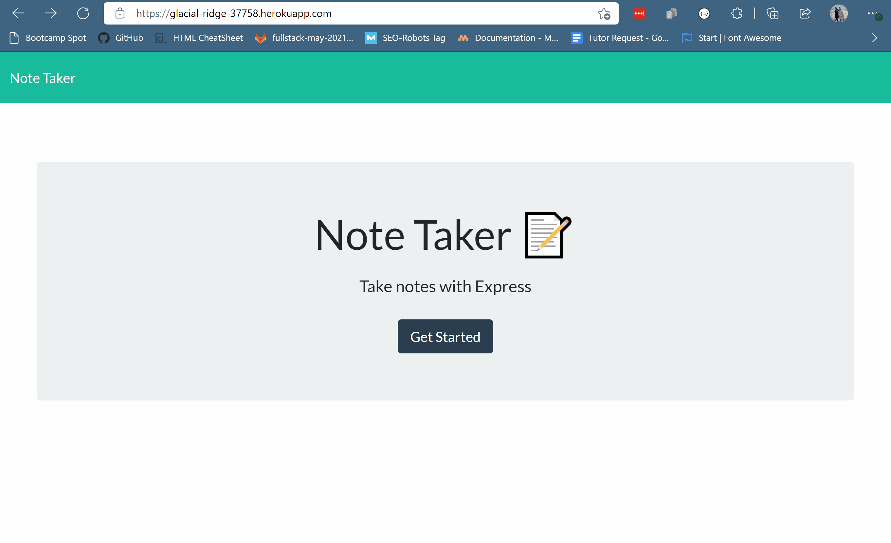

# Note Taker

## A tool that allows a user to create and delete notes

## Link to Deployed application

[Note Taker](https://glacial-ridge-37758.herokuapp.com/)

## Table of Contents

- [Motivation and Technologies](#motivation)
- [Functionality](#functionality)
- [Challenges](#challenges)
- [Usage](#usage)

## Motivation

The goal of this project is to showcase express and heroku in an application

#### Technologies

- Javascript
- Node.js
- Express.js
- Heroku

## Functionality

#### The screenshot shows the basic functionality of the application deployed to heroku

- The user navigates to the note taker by clicking 'Get Started'
- The user can then enter a title and corresponding text for the note
- The user can then save the note by clicking on the save icon in the upper right corner
- If the user chooses, they may delete one of the saved notes by clicking on the red trash bin

## Challenges

The major challenge faced in this project was how to create the delete functionality.

## Usage

- Being able to quickly and efficiently create notes that may be saved and read later or deleted if desired
